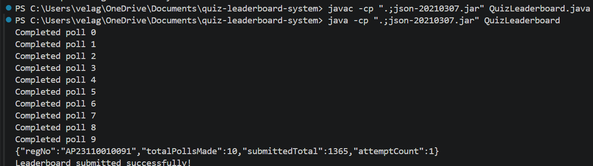

# Quiz Leaderboard System – Java API Integration Task

**Name:** Velaga Pravallika
**Registration Number:** AP23110010091
**Language:** Java

---

## Project Overview

The leaderboard system in this project collects quiz scores through the validator API, removes duplicate responses, calculates total scores for each participant, and generates the final leaderboard.

The solution simulates a real-world backend workflow involving API polling, processing, and validation.

---

## Objective

The main objectives of this assignment were:

1. Poll the validator API 10 times
2. Maintain a 5-second delay between each poll
3. Remove duplicate score entries using `(roundId + participant)`
4. Aggregate total scores per participant
5. Generate a leaderboard sorted by total score
6. Submit the leaderboard once using the submission API

---

## Approach

1. The API was called 10 times using poll values from 0 to 9
2. A `HashSet` was used to remove duplicate entries
3. A `HashMap` was used to store and update participant scores
4. The leaderboard was sorted from highest to lowest total score
5. The final leaderboard was submitted using the POST API

---

## Technologies Used

* Java
* HTTPURLConnection
* HashMap
* HashSet
* org.json library

---

## How to Run

Compile:

```
javac -cp ".;json-20210307.jar" QuizLeaderboard.java
```

Run:

```
java -cp ".;json-20210307.jar" QuizLeaderboard
```

Execution time is approximately 50 seconds due to the required delay between API calls.

---

## Result

After processing all responses correctly, the leaderboard was generated and successfully submitted through the validator API.

---

## Output Screenshot


