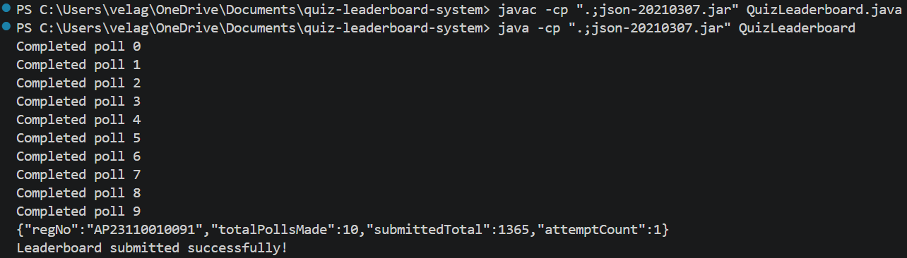

# Quiz Leaderboard System – Java API Integration Task

**Name:** Velaga Pravallika
**Registration Number:** AP23110010091
**Language:** Java

---

## Project Overview

This project implements a leaderboard system that collects quiz scores through a validator API, removes duplicate responses, calculates total scores for each participant, and generates the final leaderboard.

---

## Objective

* Poll the validator API 10 times
* Maintain a 5-second delay between each poll
* Remove duplicate entries using `(roundId + participant)`
* Aggregate scores per participant
* Generate leaderboard sorted by total score
* Submit leaderboard once using the submission API

---

## Approach

* Used `HashSet` to remove duplicate events
* Used `HashMap` to store participant scores
* Sorted leaderboard in descending order
* Submitted leaderboard using POST API

---

## Technologies Used

* Java
* HTTPURLConnection
* HashMap
* HashSet
* org.json library

---

## How to Run

Compile:

```bash
javac -cp ".;json-20210307.jar" QuizLeaderboard.java
```

Run:

```bash
java -cp ".;json-20210307.jar" QuizLeaderboard
```

---

## Output Screenshot


